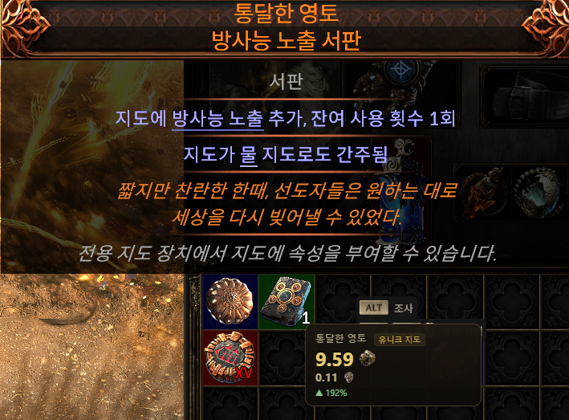
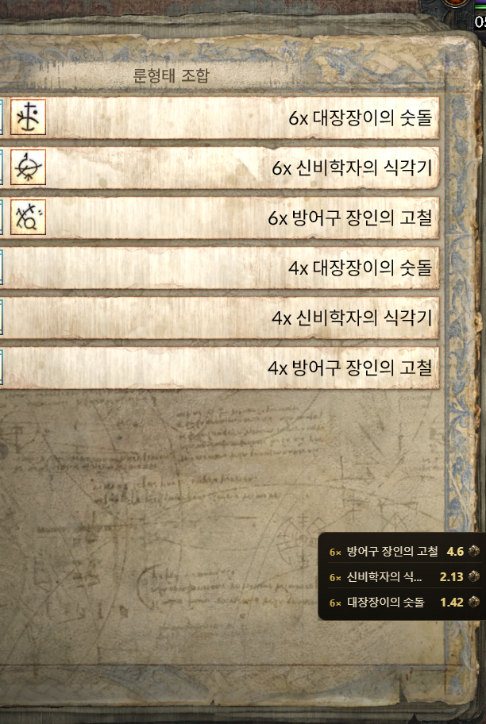

# PoE2 시세검색

Path of Exile 2 아이템 시세를 **한글로 검색**하고, 게임 중 **단축키로 바로 확인**하는 Windows 앱.

## ⬇️ [최신 버전 다운로드 (여기 클릭)](https://github.com/jsh7195/poe2-price-kr/releases/latest)

 

> [!WARNING]
> # ⚠️ 반드시 "관리자 권한으로 실행"
>
> 게임이 관리자 권한으로 돌기 때문에, 이 앱도 **관리자 권한**이어야 게임 위에서 단축키가 동작합니다.
>
> - 앱에 뜨는 빨간 **`관리자 권한으로 재실행`** 버튼을 누르거나
> - exe 파일 **우클릭 → 관리자 권한으로 실행**
> - 게임은 **창 모드 전체화면(Windowed Fullscreen)** 으로!
>
> (이걸 안 하면 F9·F10을 눌러도 아무것도 안 뜹니다.)

 

---

# 🖱️ F9 — 아이템 위에서 시세 보기

게임 중 아이템에 **마우스를 올린 채 `F9`** → 커서 옆에 시세가 뜹니다.

---

# 📋 F10 — 목록 시세 스캔 (조합·제작 화면)

조합·제작처럼 아이템에 마우스를 못 올리는 **목록 화면에서 `F10`** →
화면에서 `6x 대장장이의 숫돌` 같은 **"수량 × 아이템"** 줄을 읽어 시세를 **한 번에(비싼 순)** 보여줍니다.

---

# 🔎 검색되는 목록 (poe.ninja 기준)

시세는 [poe.ninja](https://poe.ninja/poe2/economy)에서 가져옵니다. 아래 분류에 있는 아이템이 검색·F9·F10 대상입니다.
(유니크 장비·일반 장비의 개별 옵션 가격은 다루지 않고, 아이템 **이름** 기준 시세입니다.)

**통화 · 소모품**
화폐 · 조각 · 심연의 뼈 · 미가공 젬 · 혈통 보조 젬 · 에센스 · 영혼 핵 · 우상 · 룬 · 징조 · 탐험 · 액체 감정 · 기폭제 · 베리시움

**유니크 장비**
유니크 무기 · 유니크 방어구 · 유니크 장신구 · 유니크 플라스크 · 유니크 부적 · 유니크 주얼 · 유니크 지도

---

그 외 — 앱 검색창에 한글을 입력하면 시세 검색 · 창을 닫아도 트레이에서 계속 실행 · 헤더의 **업데이트** 버튼으로 새 버전 적용.
처음 실행 시 SmartScreen 경고가 뜨면 → 추가 정보 → 실행.
비공식 팬 도구이며 GGG·poe.ninja와 무관, 공개 데이터만 사용 (MIT). 개발 정보는 [DEVELOPING.md](DEVELOPING.md).
